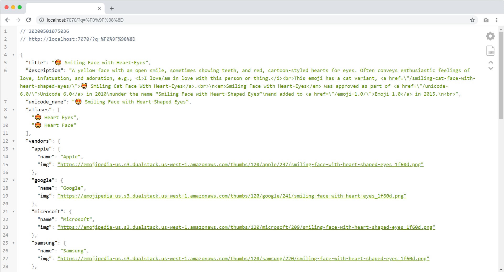

# Emoji Api PHP 🎉💃
Emoji PHP API to generate a json output  include a images of emoji and vendors names

This API-SCRIPT allows you to get title, description, aliases and images of any Emoji in this 🌏!.



## Installation
for installing this php script and use-it you need first to clone:
```bash
git clone https://github.com/el3zahaby/Emoji-Api-PHP.git
``` 
then:
```bash
composer install
``` 
to run it you will need php of course so you can you Xampp or you can just run this command line:
```bash
php -S localhost:7070
``` 
----
### donate❤!
[](https://paypal.me/el3zahaby/10) 
[](http://instagram.com/egy.js)

----

## Usage
to use this api you must host it <small>local or on host</small>
for examples in local: `http://localhost:7070/?q=[Emoji]`
```
http://localhost:7070/?q=😍
http://localhost:7070/?q=smile
http://localhost:7070/?q=Heart Eyes
http://localhost:7070/?q=egypt
```
so you can use name of emoji or just THE `emoji 😊`

## Notice
this project using simple cache system, its make the api and the whole system faster 😍, but we will improve it by time.

to remove cache you can just do this command line:
```bash
php cmd/cache.clear.php
``` 

